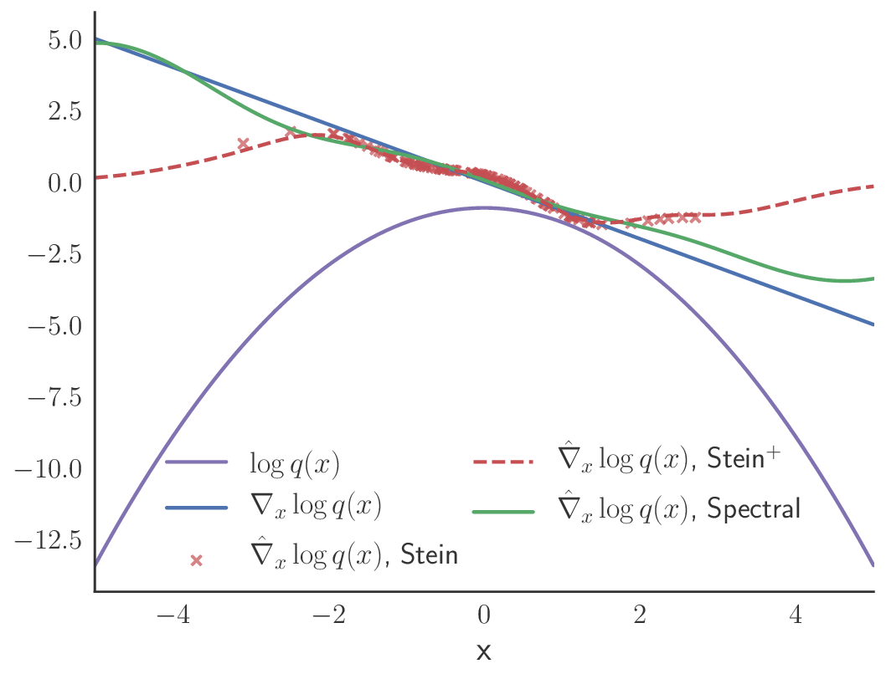

# spectral-stein-grad
Code for "A Spectral Approach to Gradient Estimation for Implicit Distributions" (ICML 18)
https://arxiv.org/abs/1806.04326

## Dependencies
* [Tensorflow >= 1.8](https://www.tensorflow.org)
* [ZhuSuan >= 0.3.1](https://github.com/thu-ml/zhusuan)

## Get Started
```
python -m toy.guassian
```


### Implicit VAEs
Train plain VAE on CelebA:
```
python -m vae.vae_celeba
```
Train implicit VAE on CelebA using entropy gradients estimated by SSGE:
```
python -m vae.vae_celeba_implicit
```

## Citation
To cite this work, please use
```
@InProceedings{shi2018spectral,
  title = 	 {A Spectral Approach to Gradient Estimation for Implicit Distributions},
  author = 	 {Shi, Jiaxin and Sun, Shengyang and Zhu, Jun},
  booktitle = 	 {Proceedings of the 35th International Conference on Machine Learning},
  pages = 	 {4651--4660},
  year = 	 {2018},
}
```
